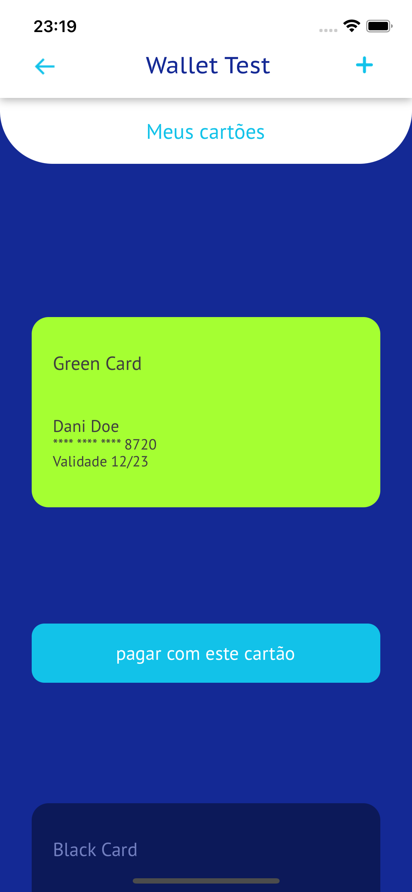
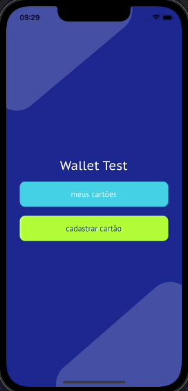
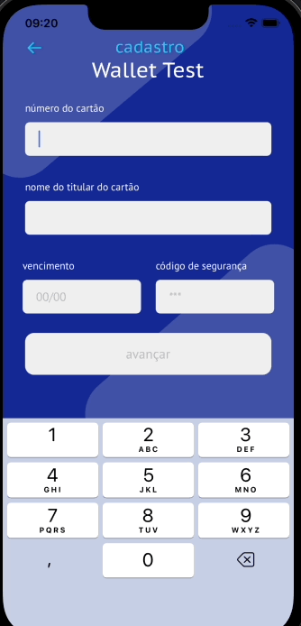

<div align="center" id="top"> 
  

&#xa0;

</div>

<h1 align="center">Wallet Test</h1>

<p align="center">
  

  

  


</p>

<h4 align="center"> 
	🚧  Wallet Test - Under construction...  🚧
</h4> 

<hr>

<p align="center">
  <a href="#about">About</a> &#xa0; | &#xa0; 
  <a href="#features">Features</a> &#xa0; | &#xa0;
  <a href="#technologies">Technologies</a> &#xa0; | &#xa0;
  <a href="#requirements">Requirements</a> &#xa0; | &#xa0;
  <a href="#starting">Starting</a> &#xa0; | &#xa0;
  <a href="https://github.com/danielbcarvalho" target="_blank">Author</a>
</p>

<br>

## About

A React Native Wallet App for managing credit cards.


## Features
* Card List; 
* Register new card;
* Pay with a card;

## Technologies

The following tools were used in this project:

- [Framework - React Native](https://reactnative.dev/)
- [Language - TypeScript](https://www.typescriptlang.org/)
- [Server - JSON SERVER](https://github.com/typicode/json-server)
- [Form - React Hook Form](https://reactnavigation.org/)
- [Styling - Styled Components](https://reactnavigation.org/)
- [Server state management - React Query](https://reactnavigation.org/)
- [Translation - i18next](https://reactnavigation.org/)
  


## Requirements

Before starting, you need to have [React Native](https://reactnative.dev/docs/environment-setup) and [JSON SERVER](https://docs.expo.io/get-started/installation/) installed.

## Starting

```bash
# Clone this project
$ git clone https://github.com/danielbcarvalho/WalletTest.git

# Access
$ cd WalletTest

# Install dependencies
$ yarn 

# Start server
$ json-server --watch db.json

# The server will initialize in the <http://localhost:3000>
```
Android
```
$ yarn android
$ yarn start
$ yarn adb:reverse // json server requirement
```
iOS
```
$ npx pod-install ios
$ yarn ios
$ yarn start
```

  

  


&#xa0;

Author
👨🏻‍💻 LinkedIn: Daniel Carvalho

<a href="#top">Back to top</a>
